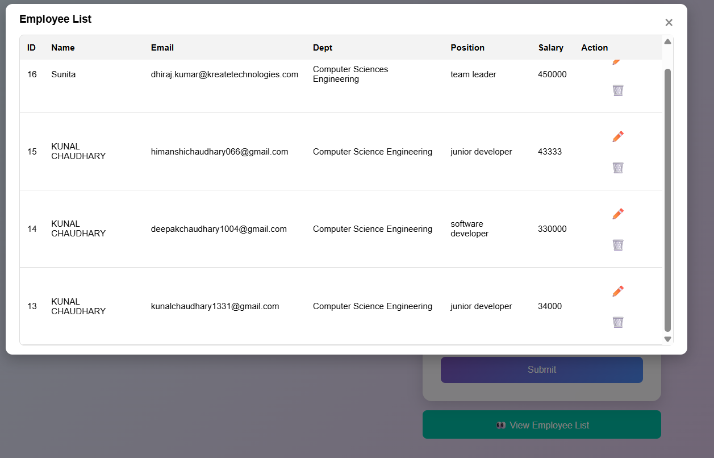

# 🚀 Employee Management System (AJAX + PHP + jQuery)

A modern **Employee Registration and Listing System** built using **PHP**, **jQuery (AJAX)**, and **MySQL** — featuring smooth form validation, dynamic modal-based employee list, and a clean responsive UI with glassmorphism effects.

---

## 🖼️ Preview

<p align="center">
  
</p>
<p align="center">
  
</p>
*(Add your project screenshot here)*

## 🧩 Features

✅ Employee Registration with Form Validation  
✅ AJAX-based CRUD Operations (No Page Reload)  
✅ Employee List in a Beautiful Modal Popup  
✅ Responsive & Modern UI Design (Glassmorphism)  
✅ Error Handling & Real-Time Feedback  
✅ Clean Code Structure for Beginners  

---

## ⚙️ Tech Stack

| Technology | Purpose |
|-------------|----------|
| **PHP 8+** | Backend Logic |
| **MySQL** | Database |
| **jQuery (AJAX)** | Asynchronous Requests |
| **HTML5 + CSS3** | Frontend & UI Design |

---

---

## 📁 Folder Structure
```bash
project-root/
│
├── ajax/
│ ├── Create.php
│ └── fetchEmployees.php
│
├── jquery-3.7.1.min.js
├── index.html
└── README.md

```

---

## Database

- Create a new database named employee_db

- Run the following SQL:

```sql
CREATE TABLE employees (
  id INT AUTO_INCREMENT PRIMARY KEY,
  name VARCHAR(100),
  dob DATE,
  email VARCHAR(100),
  department VARCHAR(100),
  position VARCHAR(100),
  salary DECIMAL(10,2)
);
```